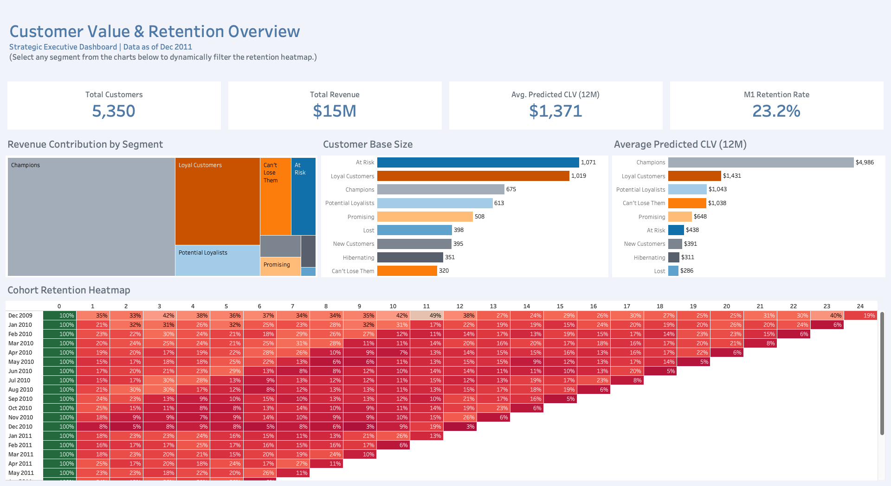
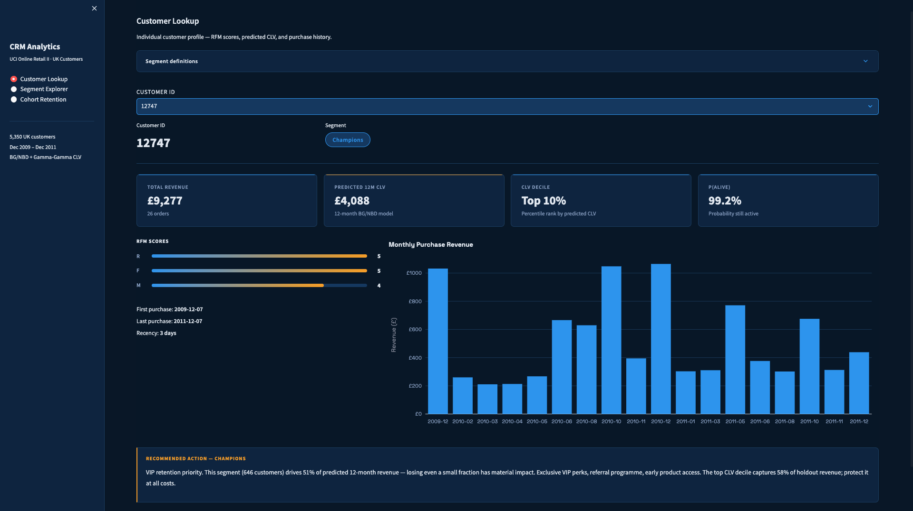
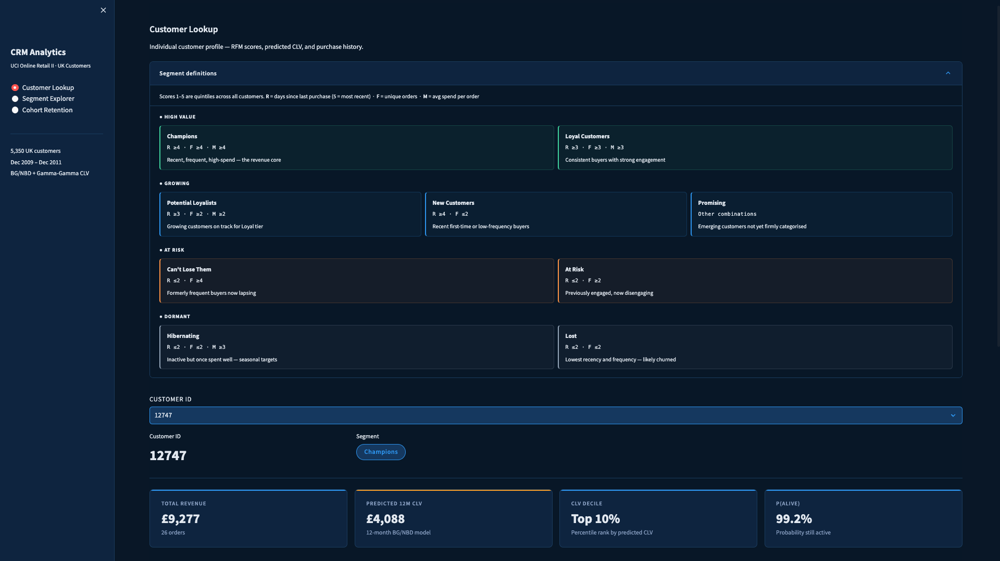
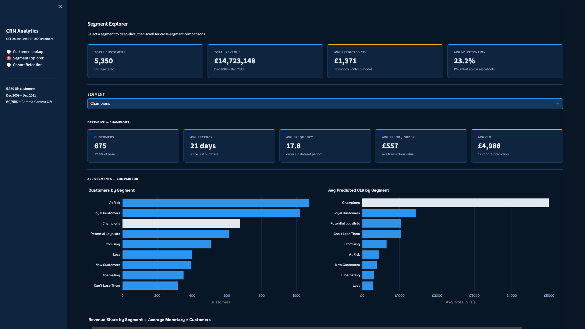
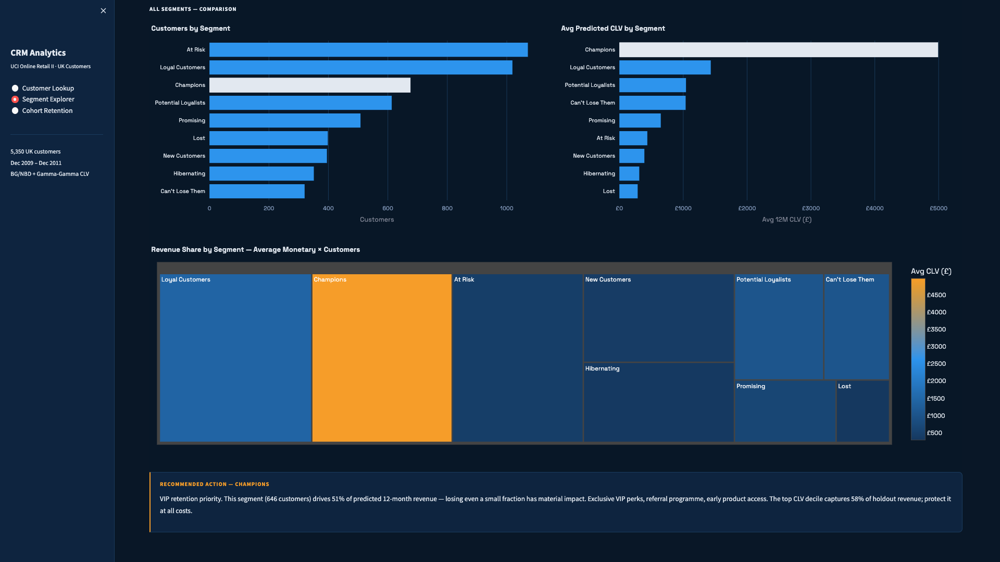
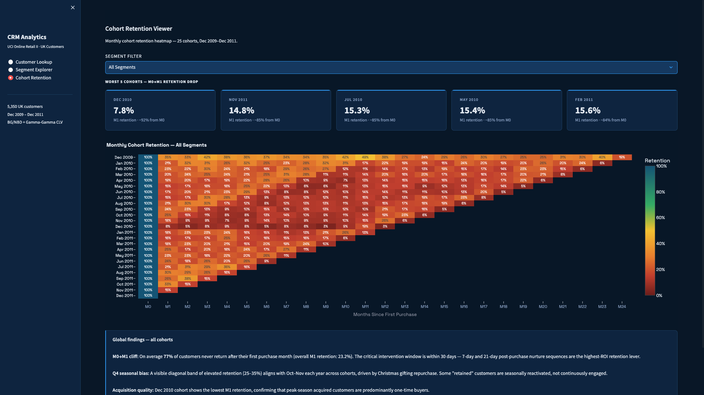

# CRM Customer Analytics
Customer Lifecycle & Value Analytics — RFM Segmentation · Cohort Retention · CLV Prediction · Dashboard

---

## Overview

End-to-end CRM analytics pipeline on the [UCI Online Retail II dataset](https://archive.ics.uci.edu/dataset/502/online+retail+ii) (UK customers, Dec 2009–Dec 2011). Covers data cleaning, exploratory analysis, RFM segmentation, cohort retention, and BG/NBD + Gamma-Gamma customer lifetime value prediction — with findings translated into segment-specific CRM actions.

**Business objective:** Turn transaction history into actionable customer intelligence — who to retain, who to win back, who to grow, and how much each is worth.

Delivered in two dashboards built for different audiences and purposes:

| | Tableau | Streamlit |
|---|---|---|
| **Link** | [View on Tableau Public](https://public.tableau.com/views/CRMAnalytics_17772842145240/CustomerValueRetentionOverview) | Run locally (see below) |
| **Audience** | Executives and stakeholders | Analysts and CRM teams |
| **Purpose** | Broadcast — answers known questions for a known audience | Self-serve — lets stakeholders explore questions the analyst didn't anticipate |
| **Build time** | 1.5 hrs | 2.5 hrs |
| **Pages** | 1 | 3 |

The self-serve design addresses a real industry pain point: analysts spending recurring time fielding one-off requests — "can you pull customer X?", "what should we do about the At Risk segment?". The Streamlit app answers both directly, without analyst involvement.

---

## Key Findings

| Finding | Detail |
|---------|--------|
| **77% M0→M1 cliff** | The majority of first-time buyers never return. Critical intervention window: within 30 days of first purchase. 7-day and 21-day post-purchase nurture sequences are the highest-ROI retention lever. |
| **Champions drive 51% of predicted revenue** | 646 customers (12% of base) account for over half of predicted 12-month CLV. The top decile alone captures 58% of holdout revenue — 5.8× lift over average. Protecting this segment is the single highest-ROI action. |
| **Can't Lose Them — most urgent win-back** | Avg CLV of £1,038 (comparable to Loyal Customers) but P(alive) has dropped to 71.8%, the lowest among active segments. Immediate high-value outreach is warranted before they cross into Lost. |
| **At Risk is the largest segment** | 1,071 customers (20% of base). Win-back ROI must be evaluated against the £438 avg CLV ceiling — prioritise the higher-CLV customers within this group. |
| **Dec cohort acquisition quality problem** | December cohorts show 8% M1 retention vs 23% average — peak-season acquired customers are predominantly one-time gift buyers. Suppress from standard retention sequences; treat separately. |
| **Hibernating = hidden opportunity** | Avg AOV of £547 — nearly matching Champions (£557). Standard reactivation ROI is low, but a targeted Q4 seasonal offer may reactivate a high-value portion. |
| **CLV model performance** | MAE 39.4% better than naive baseline. Pearson correlation 0.832 between predicted and actual holdout spend. BG/NBD + Gamma-Gamma on 18-month calibration window. |

---

## Dashboards

### Tableau — Executive Dashboard

[**View on Tableau Public →**](https://public.tableau.com/views/CRMAnalytics_17772842145240/CustomerValueRetentionOverview)

Single-page dashboard for executive stakeholders. KPI summary, RFM segment distribution, cohort retention heatmap, and CLV by segment. Segments are clickable — selecting a segment cross-filters the heatmap and CLV chart simultaneously.



---

### Streamlit — Self-Serve Operational Tool

```bash
Rscript scripts/07_load_to_sqlite.R   # build SQLite DB (run once after R pipeline)
pip install -r app/requirements.txt
streamlit run app/streamlit_app.py
```

**Page 1 — Customer Lookup**

Look up any of the 5,350 customers by ID. Returns full profile: RFM scores with inline definitions, predicted 12-month CLV, CLV percentile rank, P(alive), purchase history chart, and a segment-specific CRM action recommendation. Hover the segment badge or RFM bars for contextual explanations — no reference document needed.




**Page 2 — Segment Explorer**

Select any of the 9 RFM segments for deep-dive KPIs: customer count, avg recency, avg frequency, avg AOV, avg predicted CLV. A tailored CRM recommendation appears with each selection. Cross-segment comparisons show customer distribution, CLV ranking, and a revenue share treemap (tile size = customers, colour = avg CLV). Hovering any bar shows the segment's scoring criteria.




**Page 3 — Cohort Retention**

Monthly cohort retention heatmap across 25 cohorts, filterable by RFM segment. Highlights the five worst M0→M1 drops. Surfaces the Q4 seasonal retention bias, acquisition quality problem, and the 30-day intervention window insight with data-backed supporting evidence.



---

## Analytics Pipeline

| Script | Purpose |
|--------|---------|
| `01_data_cleaning.R` | Remove nulls, cancellations, non-UK rows; export cleaned RDS + CSV |
| `02_eda.R` | Revenue distribution, seasonality, Pareto concentration — saved plots |
| `03_rfm_segmentation.R` | RFM scoring (quintiles 1–5), 9-segment assignment, treemap and heatmap |
| `04_cohort_retention.R` | Monthly cohort retention matrix; segment-level densification for accurate weighted averages |
| `05_clv_prediction.R` | BG/NBD transaction model + Gamma-Gamma spend model; 12-month CLV prediction and validation |
| `06_export_for_tableau.R` | Flat files for Tableau: customer master, transactions, cohort matrix, segment summary |
| `07_load_to_sqlite.R` | Load all exports into `data/processed/crm.db` for Streamlit SQL queries |

---

## AI-Assisted Development

Built with [Claude Code](https://claude.ai/code) using vibe coding — conversational iteration on analysis design, model diagnostics, and dashboard implementation.

The Streamlit app UI was designed using the [interface-design](https://github.com/Dammyjay93/interface-design) skill for Claude Code — a plugin that establishes a design system (colour tokens, spacing, component patterns) at the start of a session and keeps it consistent across all subsequent UI work. This produced a coherent dark-navy design language (Space Grotesk · amber accent · precision-density layout) without manually tracking design decisions between sessions.

### Dashboard scope vs time

| | Tableau | Streamlit |
|---|---|---|
| **Build time** | 1.5 hrs | 2.5 hrs |
| **Pages / views** | 1 page | 3 pages |
| **Charts & components** | 4 KPIs · treemap · 2 bar charts · heatmap | Customer lookup · 5 KPI card groups · 3 comparison charts · cohort heatmap · CSS design system · SQLite SQL layer |
| **Interactivity** | Cross-filter (segment → heatmap) | Per-customer SQL queries · segment selector · hover tooltips with inline definitions · segment CRM recommendations |
| **Self-serve capability** | Limited — fixed views only | Full — stakeholders answer their own questions |

Streamlit took more total hours but delivered 3× the scope and a qualitatively different capability. The AI advantage here isn't raw speed — it's raising the ceiling of what's feasible to build in a single sitting, particularly on the frontend (CSS theming, Plotly configuration, interactive tooltips) where iteration cost without AI would be prohibitive.
